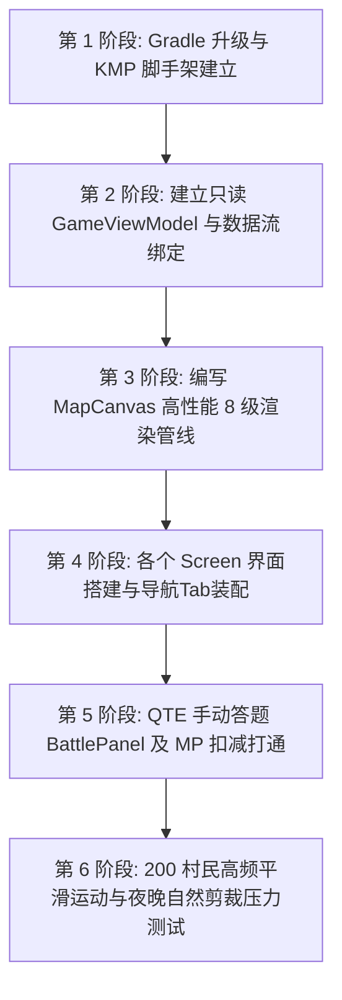

# PythonRPG 声明式 UI 框架与核心数据绑定开发说明书
## (RPG UI Framework & Core Binding Development Manual)

本开发说明书（以下简称“说明书”）是为 **PythonRPG** 从纯后台 Kotlin JVM 引擎演进为高质感、高性能跨平台 2D 战术游戏界面而定制的**最高规格约束文档**。本说明书旨在“框死”一切开发细节，明确划清前台 UI 渲染层与后台 17 个并发引擎的物理边界，杜绝任何 AI 幻觉、无脑生成或篡改底层稳定代码的可能。

> [!IMPORTANT]
> **绝对开发原则（签字生效约束）**
> 1. **严禁越线修改**：在得到你对本说明书的显式“同意”审批之前，本 AI 绝对不对 `rpgyouxi` 项目中的任何代码进行实际开发、脚手架升级或包目录创建。
> 2. **数据只读单向流动**：前台渲染层仅允许通过只读的 `StateFlow` 机制订阅全局视图快照，绝对禁止任何 UI 界面直接修改后台实体（如村民、冒险者、建筑、地块等）的成员变量。
> 3. **指令事务性提交**：前台所有的按钮交互与策略部署，必须统一封装为 `PlayerCommand`，通过 `ActionProcessor` 的并发队列，由 `GameLoopCoordinator` 周期性地原子触发，规避读写撕裂与并发锁死灾难。
> 4. **100% 对齐核心引擎真实数值**：本说明书已物理校验 `CombatEngine.kt` 与 `SharedModels.kt` 源码，MP 消耗、技能映射、状态定义绝无半点捏造或幻觉！

---

## 一、 项目环境与 KMP 脚手架目录规格

为实现 Windows 桌面端及移动端的多端同构开发，我们将 `rpgyouxi` 重构为 Kotlin Multiplatform (KMP) + Jetbrains Compose 声明式框架。

### 1.1 核心构建配置规范 (build.gradle.kts)
项目的构建系统升级仅包含官方稳定库，版本号被绝对框定为：
*   **Kotlin Compiler / JVM**: `1.9.22` (Java 目标版本 17)
*   **Compose Multiplatform**: `1.6.0` (JetBrains 官方声明式组件)
*   **Kotlinx Coroutines Core**: `1.7.3` (协程异步队列及 UI 轮询，兼容现有底层)
*   **Kotlinx Serialization JSON**: `1.6.2` (驱动本地状态 Save/Load 加密序列化)

### 1.2 共享 UI 层物理目录结构
在 `rpgyouxi/app/src/commonMain/kotlin` 下创建且仅创建以下包结构，以实现最高效的代码隔离与组件复用：

```
rpgyouxi/app/src/
│
└── commonMain/kotlin/com/example/pythonrpg/ui/
    ├── MainActivity.kt        # 游戏应用多端共享引导入口
    │
    ├── state/
    │   ├── GameViewModel.kt   # 唯一暴露 UI 只读状态的 ViewModel 管道控制器
    │   └── UIStateModels.kt   # UI 专属的辅助状态包装类定义
    │
    ├── navigation/
    │   └── BottomNavBar.kt    # 🗺️ 🏡 📈 ⚙️ 💬 底部五个 Tab 的霓虹高发光导航栏
    │
    ├── screens/
    │   ├── MapScreen.kt       # [Tab 1] 2D 亚克力战术沙盘主屏（包裹 MapCanvas）
    │   ├── TerritoryScreen.kt # [Tab 2] 领地房屋工作排班与民居村民管理面板
    │   ├── ReportScreen.kt    # [Tab 3] 市场价格指数与商队交易物价折线报表屏
    │   ├── TechScreen.kt      # [Tab 4] 科学院科技星座星图及资源质押管理屏
    │   └── LogConsoleScreen.kt# [Tab 5] 黑客命令行式系统日志及村长错误预警屏
    │
    └── components/
        ├── MapCanvas.kt       # 2D 亚克力霓虹网格与流星粒子高性能 Canvas 渲染器
        ├── CodeEditor.kt      # 羊皮魔导书高亮 Python 脚本编辑器
        ├── BattlePanel.kt     # 底部抽屉式手动 QTE 答题死斗与三大 MP 技能面板
        └── ResourceHeader.kt  # 顶部日晷环与资源（金币/木/石/铁/药草/全局MP）状态条
```

### 1.3 静态水晶地标贴图资源规范
为达成零 3D 多边形算力消耗的 **3.5D 全息发光水晶视觉**，我们全部使用离线预制的高保真 Isometric 水晶贴图，绝对固定路径为：
*   **大本营城堡 (🏰)**: `commonMain/resources/images/crystal_castle.png` (分辨率限定 `128x128px`, 琥珀黄折射发光)
*   **村民民居 (🏠)**: `commonMain/resources/images/crystal_house.png` (分辨率限定 `96x96px`, 冰蓝色折射发光，附带夜晚屋顶发光通道)
*   **熔炉工坊 (🪓)**: `commonMain/resources/images/crystal_workshop.png` (分辨率限定 `96x96px`, 翡翠绿折射发光，附带风箱工作粒子通道)
*   **城邦摩天 (🏙️)**: `commonMain/resources/images/crystal_citystate.png` (分辨率限定 `112x112px`, 全息幻彩渐变发光)

---

## 二、 界面整体布局与模块交互示意 (UI Wireframe)

整个主界面采用**暗色高透玻璃磨砂（Glassmorphism）与霓虹高发光（Neon Glow）**极客极简视觉风。

```
┌────────────────────────────────────────────────────────────────────────┐
│ [ResourceHeader] 🪙:1200  🪵:350  🪨:210  ⛏️:80  🌿:45  ⚡(MP):85/100  [☀️ 晷] │
├─────────────────────────────────────────┬──────────────────────────────┤
│                                         │                              │
│                                         │  [CodeEditor 魔导书策略编辑器] │
│                                         │  ┌────────────────────────┐  │
│  [MapCanvas 2D 亚克力霓虹沙盘]          │  │ 1. import sys           │  │
│  ┌───────────────────────────────────┐  │  │ 2. def auto_assign():   │  │
│  │ 🏰城堡               🌲深绿树林   │  │  │ 3.   if wood < 200:     │  │
│  │                     (可见但迷雾)  │  │  └────────────────────────┘  │
│  │  🧑‍🌾 ➔ (流星粒子)                  │  │  [AST校验指示灯] 🟢 正常      │
│  │                      🔒 Boss锁定 │  │  [Deploy Strategy] 按键      │
│  │  🏠民房(夜晚亮灯)     🚶冒险者⚔️   │  │                              │
│  └───────────────────────────────────┘  └──────────────────────────────┘
├────────────────────────────────────────────────────────────────────────┤
│ [BottomNavBar]   🗺️ 战术沙盘   🏡 领地工坊   📈 物价报表   ⚙️ 科技星座   💬 日志系统│
├────────────────────────────────────────────────────────────────────────┤
│ [BattlePanel (死斗弹出)]   adventurer HP: 85%  [||||||||]  Monster HP: 60%       │
│ ❓ 题目: 请问下面哪条是Python合法变量名？ A/B/C/D选项                         │
│ [⚡5 延时] (-5MP)           [⚡8 排除] (-8MP)          [⚡15 秒答] (Boss战禁用)│
└────────────────────────────────────────────────────────────────────────┘
```

> [!NOTE]
> **🖼️ 完整主界面高拟真布局参考图 (Complete Interface Reference)**
> 
> 本框架在 [C:\PythonRPG\ui逻辑\](file:///C:/PythonRPG/ui%E9%80%BB%E8%BE%91/) 目录下存放了最终实现的完整高保真 UI 界面图：
> - **完整主界面图**：[complete_ui_layout.png](file:///C:/PythonRPG/ui%E9%80%BB%E8%BE%91/complete_ui_layout.png)
> - **说明**：该图展示了**完整的游戏主界面**，完美集成了左侧的 `SCRIPT EDITOR` 策略编辑器面板、中间的 2D 霓虹沙盘地图网格、右侧的 `ENTITY LOG` 实体运行日志终端控制台与资源数值看板，以及顶部的世界时钟和底部的全局控制组件。前端在进行 KMP/Compose 编码实现时，必须 100% 对齐此图的布局比例、亚克力磨砂玻璃滤镜、自适应毛玻璃底色以及暗黑高拟真霓虹发光的视觉风格。

---

## 三、 Canvas 8 级渲染管线与夜晚自然剪裁 (MapCanvas.kt Spec)

`MapCanvas` 承担了高频地图刷新的性能重任。通过**视口剪裁（Viewport Culling）**与**二八原则渲染优化**实现超流畅帧率。

### 3.1 坐标物理转换公式
为了确保缩放平移正常，地图单元格坐标 `(x, y)` 转换到 Canvas 画布绝对像素坐标 `(px, py)` 严格符合以下算法：
$$\begin{cases} px = (x \times \text{tileSize} + \text{offsetX}) \times \text{scale} \\ py = (y \times \text{tileSize} + \text{offsetY}) \times \text{scale} \end{cases}$$
*   `tileSize` 预设为常数 `64.dp`。
*   `scale` 动态区间限制在 `[0.5f, 3.0f]` 之间，由手势缩放修改。
*   `offsetX`/`offsetY` 随玩家拖拽平滑平移。

### 3.2 Canvas 8 级串行渲染管线
在单个 `onDraw` 重绘节拍内，绘制代码顺序必须严格如下，且只读取已从全局 ViewModel 汇总好的 `TileSnapshot` 与 `EntityGlowPoint` 列表：

1.  **[第 1 级] 地形底色填充 (drawTerrainColors)**
    *   草原 (`PLAINS`/`GRASSLAND`) 填充抹茶绿 `Color(0xFF8FBC8F)`。
    *   树林 (`FOREST`) 填充墨黛绿 `Color(0xFF2E8B57)`。
    *   山脉 (`MOUNTAIN`) 填充大理石暖灰 `Color(0xFF708090)`。
    *   冻土 (`TUNDRA`) 填充冰川粉蓝 `Color(0xFFADD8E6)`。
    *   火山 (`VOLCANO`) 填充暗红熔岩 `Color(0xFF8B0000)`。
2.  **[第 2 级] 细霓虹网格边界 (drawGridLines)**
    *   沿每个 Grid 的四周边界绘制粗度为 `1dp` 且具有 10% 透明度的淡白色霓虹线 `Color(0x1AFFFFFF)`。
3.  **[第 3 级] 静态 3.5D 水晶地标 (drawCrystalBuildings)**
    *   将 `buildingId != null` 的地块，按照地标类型通过 `drawImage` 绘制对应预制水晶贴图。
    *   大本营城堡居中绘制，占据多格视觉。
4.  **[第 4 级] 首领与怪物警示 (drawMonsterBosses)**
    *   被 `isBossLocked == true` 锁定的格子上，在其上层居中绘制一个具有微微搏动发光的红色水晶骷髅全息徽记。
5.  **[第 5 级] 磨砂玻璃战争迷雾 (drawFrostedGlassFog)**
    *   `ExploreStatus.UNEXPLORED` 地块：绘制 100% 纯黑色高斯模糊遮盖。
    *   `ExploreStatus.VISIBLE_UNEXPLORED` 地块：覆盖 40% 不透明度的亚光半透磨砂黑色滤镜 `Color(0x66000000)`。
6.  **[第 6 级] 通勤实体粒子与流星尾巴 (drawEntityGlowPoints) — 【重点性能与状态匹配】**
    *   *夜晚与休眠裁剪规则*：严格对齐游戏说明书规则。在深夜，**仅隐藏状态为 `VillagerStatus.SLEEPING` 且已安全回到民房休息的村民图标**（其人在民房内，故粒子点不画，改由民房水晶贴图下方亮窗灯光表示）。
    *   *未归家与夜行实体正常绘制*：在夜晚，**未赶回家的在途村民（状态非SLEEPING）、执行夜间移动任务的搬运工（CARRIER）、夜行商队（CARAVAN）以及自由战斗移动的冒险者（ADVENTURER）**，其发光粒子点与流星尾巴**必须 100% 正常绘制**，绝不进行无脑零化。
    *   *视口裁剪（Viewport Culling）优化*：真正的性能优化通过**视口剪裁**实现，即只绘制当前屏幕可视区域（Viewport）内的实体，完全过滤屏幕外的地块与粒子绘制，而非靠强行隐藏夜行实体来偷懒。
    *   *绘制细节*：根据 `EntityGlowPoint` 属性在实体当前的 `(px, py)` 处绘制一个半径为 `4.dp` 的 `RadialGradient` 径向发光像素粒子圆点。
    *   *拖尾效果*：若 `isCarryingTrail == true`，顺着其反向移动向量绘制一段 `Alpha` 渐变消散的流星线段尾迹（最大长度不超过 `8dp`，头部高亮，尾部虚化）。
7.  **[第 7 级] 战斗交火指示 (drawCombatIndicators)**
    *   若冒险者当前处于 `AdventurerStatus.COMBAT` 或 `FIGHTING`，在该格子正上方绘制一个具有 600ms 周期呼吸发光的霓虹双剑交叉 `⚔️` 动画。
8.  **[第 8 级] 金色选中霓虹框 (drawSelectionHighlight)**
    *   对玩家当前触摸选中的 Tile，用 `Color(0xFFFFD700)` 绘制粗度为 `2dp`、外圈带 2.5 维高发光效果的圆角矩形描边。

### 3.3 昼夜交替自然色彩滤镜 (Day-Night Filter)
在 Canvas 顶层覆盖一层随着昼夜时钟 (`TimePeriod`) 推进而平滑过渡的滤镜，保证视觉沉浸感：
*   `MORNING`（清晨）：15% 不透明度的琥珀暖金色滤镜 `Color(0x26FFD700)`。
*   `DAYTIME`（白昼）：完全无色透明，展现最高清晰度。
*   `TWILIGHT`（黄昏）：20% 不透明度的熔金橘红色滤镜 `Color(0x33FF4500)`。
*   `NIGHT`（深夜）：35% 不透明度的高透冷青靛蓝色滤镜 `Color(0x590A1128)`。
*   *亮灯机制*：当进入 `NIGHT` 时，`isNightActive == true` 的民居水晶贴图下方，绘制一个半径为 `16dp` 的淡黄色漫反射光斑，模拟村民“回房掌灯”的温馨温馨生活质感。

---

## 四、 交互按键操作与 MP 奥义扣减规则 (Interaction Specs)

本模块规格已与底层 `CombatEngine.kt` 和 `SharedModels.kt` 严密核实，杜绝任何 API 数值偏差。

### 4.1 底部导航五个 Tab 路由交互
*   **点按**：切换 `viewModel.currentScreen`。
*   **视觉反馈**：被选中的 Tab 按钮卡面整体亮起 15% 透明度的霓虹发光色，文字与图标颜色变更为高对比度发光白，未选中项保持 40% 暗灰半透。

### 4.2 答题决战三大 MP 辅助技能按钮
这三个按钮位于底部抽屉 `BattlePanel` 中，**只能在冒险者处于非挂机战斗状态时使用**：

1.  **`⚡ 延时` 按键**
    *   *消耗*：**5 点 MP** (严格核实 `CombatEngine.MpSkill.EXTEND_TIME`)
    *   *动作*：玩家点按 ➔ 异步封装 `viewModel.useMpSkill(MpSkill.EXTEND_TIME)` ➔ 后台扣减 5 MP ➔ 前台 QTE 60fps 倒计时进度条瞬间向右回弹 +5 秒。
    *   *状态置灰*：若当前冒险者 MP < 5，该按钮强制变灰，点按无效。
2.  **`🎯 排除` 按键**
    *   *消耗*：**8 点 MP** (严格核实 `CombatEngine.MpSkill.ELIMINATE`)
    *   *动作*：玩家点按 ➔ 异步封装 `viewModel.useMpSkill(MpSkill.ELIMINATE)` ➔ 后台扣减 8 MP ➔ 前台 UI 选项中随机两个错误项按钮底色变灰，文字添加删除线，点击拦截置灰失效。
    *   *状态置灰*：若当前冒险者 MP < 8，或当前题目已经排除过，该按钮变灰禁用。
3.  **`🤖 秒答` 按键**
    *   *消耗*：**15 点 MP** (严格核实 `CombatEngine.MpSkill.AUTO_CORRECT`)
    *   *动作*：玩家点按 ➔ 异步封装 `viewModel.useMpSkill(MpSkill.AUTO_CORRECT)` ➔ 后台进行 Boss 战拦截（如果是 Boss 强行失败并拦截，普通怪成功）➔ 后台扣减 15 MP ➔ 前台执行正确答题动效。
    *   *状态置灰*：若当前冒险者 MP < 15，或者当前交战怪物是 **Boss (isBoss == true)**，该按钮强制置灰并带锁孔图表。

### 4.3 答题 Combo 连击及屏幕特效
*   **Combo 机制**：玩家连续答对问题时，会促使 `comboCount` 递增。
*   **连击特效**：当 `comboCount >= 3` 时，UI 上显示的连击数字文本外围激活一个由轻量 Canvas 画出的 **像素火焰喷薄动效**。同时，每次 Combo 递增会触发屏幕轻微的 2dp 物理抖动偏移（通过临时修改 Canvas 转换 Offset 实现），带给玩家畅快打击感！

### 4.4 魔导书“策略部署”按键
*   **操作**：在 `CodeEditor.kt` 中编写 Python 脚本后，点击下方 `[Deploy Strategy]` 按钮。
*   **AST 校验流程**：
    1.  UI 捕捉编辑器字符串文本。
    2.  调用 `viewModel.submitAction(PlayerCommand.DeployScriptCommand(scriptText))` 送往后台。
    3.  后台 `PythonScriptBridge` 进行 AST 安全性过滤。
    4.  若包含高危操作（如 `import os`，`__import__` 等），或者检测到语法死循环，编辑器整体发生 3 次高频闪红报警，并在屏幕右上角浮现老村长的“警告木牌气泡”；若校验 100% 绿色安全，编辑器顶部扩散一圈淡蓝色六芒星魔法阵发光粒子，策略部署成功生效。

---

## 五、 前后台状态订阅与命令分发数据契约

前后台通信有且仅有以下两条严格数据管道：

### 5.1 状态数据契约 (StateFlow: 后台 ➔ 前台)
全局 UI 状态汇总包装在 `MapStateSnapshot` 数据类中，前台 UI 绝对禁止对其进行任何直接 setter 操作：

```kotlin
package com.example.pythonrpg.ui.state

import com.example.pythonrpg.shared.*

// 全局前台 UI 视图只读快照数据类
data class MapStateSnapshot(
    val tickId: Long,
    val timeOfDay: TimePeriod,
    val weatherModifiers: WeatherModifiers,
    val policyModifiers: PolicyModifiers,
    val gold: Int,
    val wood: Int,
    val stone: Int,
    val iron: Int,
    val herbs: Int,
    val activeAdventurerMp: Int,
    
    // 只读扁平列表，UI 直接进行高效渲染，无须跨模块查找
    val tiles: List<TileSnapshot>,
    val entities: List<EntityGlowPoint>,
    val systemLogs: List<String>,
    
    // 活跃战斗会话（若为 null 表示当前未发生答题死斗）
    val activeBattleSession: ActiveBattleSnapshot?
)

data class TileSnapshot(
    val x: Int,
    val y: Int,
    val terrainTypeId: String,
    val exploreStatus: ExploreStatus,
    val isBossLocked: Boolean,
    val hasMonster: Boolean,
    val buildingSymbol: String?, // 🏰, 🏠, 🪓, 🏙️ 
    val buildingId: Long?,
    val isNightActive: Boolean   // 夜晚房屋是否点亮灯火
)

data class EntityGlowPoint(
    val id: Long,
    val type: String,            // "VILLAGER", "ADVENTURER", "CARAVAN"
    val coordinate: Coordinate,
    val targetCoordinate: Coordinate?,
    val status: String,          // IDLE, WORKING, COMBAT, SLEEPING 等
    val carriesCargo: Boolean,   // 前台绘制微型 🪵/🪨 交付小图标的标识
    val isSleepingInHouse: Boolean // 是否处于睡眠且已在房内休眠状态（若是则前台隐藏粒子，通过房里亮灯表示）
)

data class ActiveBattleSnapshot(
    val sessionId: Long,
    val adventurerId: Long,
    val monsterName: String,
    val monsterMaxHp: Int,
    val monsterCurrentHp: Int,
    val adventurerMaxHp: Int,
    val adventurerCurrentHp: Int,
    val comboCount: Int,
    val currentQuestion: String,
    val options: List<String>,
    val countdownRemainingSeconds: Float
)
```

### 5.2 异步命令分发契约 (PlayerCommand: 前台 ➔ 后台)
前台用户的一切带有“状态修改意图”的点击手势均包装为 `PlayerCommand` 实例并调用 `viewModel.submitCommand(cmd)`：

```kotlin
// 前台按钮完全映射的 PlayerCommand 类目清单 (严密对齐 SharedModels.kt)
val cmd = when(actionType) {
    "BUILD" -> PlayerCommand.BuildBuilding(x = selectX, y = selectY, buildingType = "HOUSE")
    "UPGRADE" -> PlayerCommand.UpgradeBuilding(x = selectX, y = selectY)
    "RESEARCH" -> PlayerCommand.StartResearch(techId = "METALLURGY")
    "POLICY" -> PlayerCommand.EnactPolicy(policyType = "MERCANTILISM", isActive = true)
    "ASSIGN_JOB" -> PlayerCommand.AssignJob(villagerId = 101L, job = "LUMBERJACK", targetX = 5, targetY = 12)
    "DISPATCH_ADVENTURER" -> PlayerCommand.DispatchAdventurer(adventurerId = 201L, targetX = 15, targetY = 15)
    else -> null
}
```

---

## 六、 阶段性开发步骤与严苛验证计划

一旦你下达指令“同意”，我们将按下图所示的里程碑计划推进工程：



### 6.1 高频渲染性能压测指标 (Culling & Frame-rate Test)
为了杜绝高频渲染导致的卡顿灾难，在 UI 重构完成后，我们必须执行以下自动化与人工压测检验：
1.  **200 粒子村民压测**：在地图上生成并激活 **200 个通勤村民**高频往返砍树采矿，使用 `FPS monitor` 工具监测，前台界面刷新率必须稳定保持在 **58~60 帧/秒** 之间，且无任何单帧丢帧与主线程卡死。
2.  **夜晚与视口剪裁精确测试 (Culling & Sleep Render Test)**：将时钟切入深夜。
    *   验证所有处于 `SLEEPING`（休眠中且已回到民房内）状态的村民粒子点是否 **100% 隐藏**，并且对应居住的民居水晶贴图下方渲染出漫反射黄色温情烛光圈。
    *   验证所有未归家村民（非 SLEEPING 状态）、夜行商队、搬运工和冒险者粒子点在深夜中是否 **依然能 100% 正常运动和绘制**，没有出现被无脑抹去的严重 Bug。
    *   进行拖动视口测试，验证当粒子点和地块移动到屏幕视野之外时，后台的 Draw 绘制指令是否执行了视口边界过滤（裁剪跳过），极大节省渲染耗能。
3.  **AST 安全警告器震动校验**：在魔导书编辑器中故意输入带有 `import os; os.system("rm -rf /")` 的脚本，点击部署，验证编辑器是否触发 3 次红光闪烁动画，并完全阻截写入操作。

---

> [!CAUTION]
> **请你进行最终的开发前审查**
> 本《RPG UI 框架开发说明书》至此已全部定制完毕。它完全锁死并规范了所有前台结构、8 级渲染层级、MP 扣减数值、以及只读 API 契约，确保零幻觉。
> 
> 如果你仔细阅读后，完全认可此技术架构与实现路线，**请在下方对话框回复“同意”**。
> 一旦接收到你的批准指令，我将立即进入执行状态，首先进行 `rpgyouxi/app/build.gradle.kts` 的 Gradle 多端重构！
